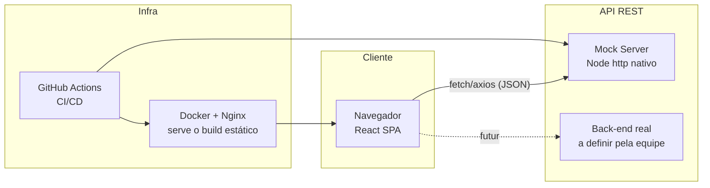

# BookSwap — Documentação do Projeto

**Tech Challenge — Fase 03 (Full Stack Development)**

> Este documento cobre o item "Documentação" da entrega: arquitetura do
> sistema, guia de uso e relato de experiências da equipe. Para instruções
> de setup rápido (rodar localmente, Docker, testes), veja o `README.md` na
> raiz do repositório — este documento foca na visão de conjunto.

---

## 1. Visão geral

O BookSwap é um marketplace de troca, venda e doação de livros e materiais
didáticos entre alunos. Cada aluno pode publicar anúncios dos materiais que
já usou, buscar/filtrar o que outros colegas anunciaram, e negociar
diretamente com o autor do anúncio.

O projeto nasceu como uma adaptação do enunciado original do Tech Challenge
(uma aplicação de blogging entre professores e alunos): a estrutura técnica
— autenticação, formulários, upload de imagem, listagem com filtros — foi
reaproveitada, e o domínio foi trocado de "post de blog" para "anúncio de
material". A justificativa dessa escolha e o mapeamento completo entre os
dois domínios estão registrados no histórico de decisões do projeto.

**Papéis de usuário:** ao contrário do sistema original (que tinha
PROFESSOR e ALUNO como papéis com permissões diferentes), o BookSwap tem um
único tipo de usuário. A permissão de editar ou excluir um anúncio não vem
de um papel fixo — vem de ser o autor daquele anúncio específico.

---

## 2. Arquitetura do sistema

### 2.1 Visão de alto nível



Hoje o front conversa com um **mock server** local (implementação completa
do contrato de API em `mock-server/`, sem dependências externas). Quando o
back-end definitivo existir, só a variável `VITE_API_URL` muda — o contrato
de API já está fechado e documentado em `API-CONTRACT.md`, então nenhuma
tela precisa ser reescrita.

### 2.2 Stack técnica

| Camada | Tecnologia | Motivo |
|---|---|---|
| UI | React 19 + TypeScript | componentes funcionais + hooks, tipagem estática |
| Build | Vite | dev server rápido, build otimizado |
| Estilo | Tailwind CSS | utilitários, consistência visual sem CSS solto |
| Roteamento | React Router v7 | rotas aninhadas com guards (`RequireAuth`, `RequireOwner`) |
| Estado de auth/toast | Context API | dispensa Redux para o escopo do projeto |
| HTTP | Axios | interceptor de token centralizado |
| Testes (front) | Vitest + React Testing Library | integrado ao Vite, testa comportamento, não implementação |
| Testes (mock server) | `node:test` | zero dependências, roda com o Node puro |
| Containerização | Docker (multi-stage) + Nginx | imagem final leve, sem toolchain de build |
| CI/CD | GitHub Actions | lint, type-check, testes e build a cada push/PR |

### 2.3 Estrutura de pastas

```
src/
├── components/
│   ├── layout/       # Header, Footer, Layout, UserMenu
│   └── listing/       # ListingForm, ListingFilters
├── context/            # AuthContext, ToastContext
├── hooks/              # useAuth, useToast, useDebouncedValue, useClickOutside
├── interfaces/         # tipos: IListing, IUser, IAuth, IDiscipline, IToast
├── pages/              # uma página por rota
├── routes/             # AppRoutes, RequireAuth, RequireOwner
├── services/           # chamadas REST (api.ts, listingService.ts, etc.)
├── test/               # setup do Vitest
├── types/               # tipos auxiliares (roleUsers, searchSuggestion)
└── utils/               # funções puras (normalização de texto)
```

Cada `service` expõe funções `*Request` que encapsulam uma chamada REST e
devolvem já o formato que a UI precisa — nenhum componente chama `axios`
diretamente.

### 2.4 Autenticação e autorização

- **Autenticação:** login retorna um token, guardado em `sessionStorage`
  junto com os dados do usuário. Um interceptor do Axios (`services/api.ts`)
  anexa o header `Authorization: Bearer <token>` em toda requisição
  automaticamente.
- **Autorização:** não existe checagem de "papel" (`role`) em lugar nenhum
  da lógica de permissão. Em vez disso, `routes/RequireOwner.tsx` busca o
  anúncio antes de liberar a tela de edição e compara
  `listing.author._id === user.id`. **Importante:** essa checagem no front
  é só UX (evita levar o usuário a uma tela inútil) — a validação que
  realmente importa acontece no back-end a cada `PUT`/`DELETE` (ver
  `API-CONTRACT.md`, seção "Regras de autorização"), e o mock server já
  implementa isso de verdade (retorna `403` se o token não é do autor).

### 2.5 Contrato de API e mock server

Antes de qualquer integração, fechamos o contrato de API
(`API-CONTRACT.md`) com todos os endpoints, formatos de request/response,
códigos de status e regras de autorização — incluindo os pontos que ficaram
em aberto para alinhar com quem for construir o back-end definitivo (quem
pode mudar o status de um anúncio, se existe canal de mensagem entre
interessado e autor, etc.).

Pra não travar o desenvolvimento do front esperando o back-end, implementamos
esse contrato num **mock server** (`mock-server/`) — um servidor Node real,
com estado em memória, zero dependências externas, cobrindo 100% dos
endpoints do contrato (incluindo upload de imagem). Ele é usado tanto em
desenvolvimento local quanto no `docker-compose.yml` e no CI.

### 2.6 Upload de imagem

O upload é implementado ponta a ponta: o front converte o arquivo
selecionado para base64 e envia num JSON pro mock server, que salva em
disco e devolve uma URL servível. Essa escolha (base64 em JSON) é uma
conveniência do mock, documentada explicitamente em `API-CONTRACT.md` como
**não recomendada para produção** — a seção "Decisão para o time de
back-end" lista as alternativas (multipart tradicional ou presigned URL) e
recomenda multipart para o MVP real.

### 2.7 Testes

- **Front-end:** cobre lógica pura (`normalizeText`, `validateImageFile`),
  um hook com timers (`useDebouncedValue`), um componente com interação de
  usuário (`ListingFilters`), uma página inteira com serviço mockado
  (`Home`) e o fluxo de autenticação completo (`AuthContext`: login,
  logout, persistência de sessão, tratamento de erro).
- **Mock server:** 24 testes de integração reais (`node:test`) — sobem o
  servidor numa porta dedicada e testam os endpoints via `fetch`,
  incluindo os casos de autorização (edição/exclusão por quem não é dono
  retorna `403`) e favoritos isolados por usuário.

### 2.8 CI/CD

`.github/workflows/ci.yml` roda em todo push/PR pra `main`, em 3 jobs:

1. `frontend` — lint → type-check → testes → build.
2. `mock-server` — sintaxe → suíte de testes real.
3. `docker-build` — builda as duas imagens Docker (só roda se 1 e 2
   passarem).

---

## 3. Guia de uso

### 3.1 Fluxo do usuário

1. **Login** — tela inicial, com credenciais de teste visíveis (mock
   server) enquanto não há back-end real.
2. **Home** — lista de anúncios disponíveis, com busca por texto (com
   debounce), filtro por disciplina, tipo (troca/venda/doação) e faixa de
   preço, e paginação.
3. **Ver anúncio** — clique em qualquer card abre os detalhes completos:
   descrição, condição, disciplina, dados de contato do autor. Um botão de
   coração permite favoritar/desfavoritar o anúncio. Se o usuário logado
   for o autor, aparece também um botão "Editar".
4. **Criar anúncio** — formulário com upload de foto (com preview),
   título, descrição, disciplina, condição, tipo e preço (quando aplicável).
5. **Editar/excluir anúncio** — só acessível pelo autor; tentativa de
   acessar a edição de um anúncio de outra pessoa redireciona de volta pra
   Home.
6. **Meus anúncios** — lista só os anúncios do usuário logado, com opção
   de editar ou excluir cada um.
7. **Favoritos** — lista os anúncios que o usuário marcou com o coração.
8. **Perfil** — dados do usuário logado (nome, usuário, e-mail) e opção de
   sair da conta.
9. **Páginas institucionais** — Sobre, Como funciona, Termos de uso e
   Política de privacidade, acessíveis pelo rodapé.

**Resiliência a falhas:** se o mock server (ou, no futuro, o back-end
real) estiver fora do ar, as páginas que buscam dados (`Home`,
`ListingView`, `MyListings`) mostram uma mensagem de erro com botão
"Tentar novamente", em vez de ficar com uma tela vazia ou carregando pra
sempre. Um `ErrorBoundary` global também evita tela branca caso algum
componente quebre em tempo de execução.

### 3.2 Rodando o projeto

Ver `README.md` para o passo a passo completo (setup local, Docker,
testes). Resumo rápido:

```bash
# mock server (terminal 1)
cd mock-server && node server.js

# front-end (terminal 2)
cp .env.example .env
npm install && npm run dev
```

Ou tudo de uma vez com Docker:

```bash
docker compose up --build
```

---

## 4. Relato de experiências e desafios enfrentados

> ⚠️ **Esta seção é para a equipe preencher** — é a parte da entrega que
> descreve a experiência real de vocês, e isso eu não posso escrever por
> vocês. Deixei perguntas-guia abaixo pra facilitar; apaguem as que não se
> aplicarem e escrevam livremente.

**Decisões técnicas que geraram mais discussão**
- Por que reaproveitar a estrutura de outro projeto em vez de começar do
  zero? Quais trade-offs vocês pesaram?
- Por que trocar "papel fixo" (PROFESSOR/ALUNO) por "autorização por dono
  do recurso"? Teve alguma dúvida ou divergência na equipe sobre isso?

**Desafios técnicos**
- O que foi mais difícil de implementar ou entender? (ex: autenticação,
  upload de imagem, integração com uma API que ainda não existia)
- Teve algum bug ou comportamento inesperado que deu trabalho para
  resolver? Como foi encontrado e corrigido?

**Trabalho em equipe e processo**
- Como o trabalho foi dividido entre vocês?
- Usaram o mock server pra trabalhar em paralelo com o back-end? Isso
  ajudou ou criou atrito quando o contrato precisou mudar?

**O que vocês fariam diferente**
- Alguma decisão de arquitetura que, olhando pra trás, vocês mudariam?
- O que ficou de fora do escopo por falta de tempo, e por quê?

**Aprendizados**
- O que cada integrante da equipe sente que aprendeu de mais relevante
  neste desafio?

---

## 5. Equipe

| Nome | Papel/contribuição |
|---|---|
| _preencher_ | _preencher_ |

## 6. Links

- Repositório: `_preencher com a URL do GitHub_`
- Vídeo de apresentação: `_preencher com o link_`
